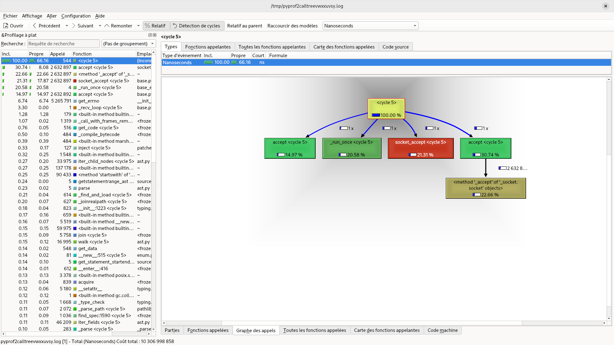

## Eventlet debug resources

### Run a Specific Unit Test Case

Run all the tests of the wsgi test module:

```shell
.tox/py312-asyncio/bin/py.test tests/wsgi_test.py
```

Run a specific [unit test case](https://docs.python.org/3/library/unittest.html#unittest.TestCase) of the wsgi test module:

```shell
.tox/py312-asyncio/bin/py.test tests/wsgi_test.py::TestHttpd
```

Run an individual test belonging to a specific [unit test case](https://docs.python.org/3/library/unittest.html#unittest.TestCase) of the wsgi test module:

```shell
.tox/py312-asyncio/bin/py.test tests/wsgi_test.py::TestHttpd::test_close_idle_connections_listen_socket_closed
```

### Switch between hubs

Eventlet provide [various hubs](https://eventlet.readthedocs.io/en/latest/hubs.html). Hubs are designed to dispatches I/O events and schedules greenthreads.

Eventlet provide multiple hub implementations. The goal here is to see how to switch to one hub to another during your debug session.

Using Eventlet's [asyncio hub](https://eventlet.readthedocs.io/en/latest/migration.html#step-1-switch-to-the-asyncio-hub):

```shell
export EVENTLET_HUB=asyncio; .tox/py312-asyncio/bin/py.test tests/wsgi_test.py::TestHttpd
```

Using Eventlet's epoll hub:

```shell
export EVENTLET_HUB=epoll; .tox/py312-asyncio/bin/py.test tests/wsgi_test.py::TestHttpd
```

### Strace Unit Tests

[strace](https://strace.io/) is a diagnostic, debugging and
instructional userspace utility for Linux. It is used to monitor
and tamper with interactions between processes and the Linux kernel,
which include system calls, signal deliveries, and changes of process
state.

During your debug session you may want to `strace` your unit tests or a specific eventlet runtime. This section show you some examples of `strace` usages in an Eventlet context.

Strace a specific unit test from the [wsgi test module](https://github.com/eventlet/eventlet/blob/master/tests/wsgi_test.py):

```shell
.tox/py312-asyncio/bin/py.test tests/wsgi_test.py::TestHttpd::test_001_server & strace -p $!
```

The `$!` parameter allow you to retrieve the process ID (pid) of the most recently executed process. As we put the execution of your unit test in background, the strace command should normally retrieve the pid of your unit test.

To avoid unexpected pid creation I'd suggest to use a container to run your unit tests and to isolate your process in an environment with a low system activity level. You can use my [machine project](https://github.com/4383/machine) to setup this isolated environment. Here below is a demo of this kind of environment.

[](https://asciinema.org/a/0e7cLRsHiNJlBQdlIgdkApAsU)

### Profile Unit Tests

Profiling a specific unit test (`test_001_server`) from the wsgi test module:

```
$ export EVENTLET_HUB=asyncio; \
.tox/py312-asyncio/bin/python -m cProfile -o profiling.cprof \
.tox/py312-asyncio/bin/py.test \
tests/wsgi_test.py::TestHttpd::test_001_server
```

You can even profile and `strace` this test at the same time:

```
$ export EVENTLET_HUB=asyncio; \
.tox/py312-asyncio/bin/python -m cProfile -o profiling.cprof \
.tox/py312-asyncio/bin/py.test \
tests/wsgi_test.py::TestHttpd::test_001_server & \
strace -p $!
```

Once done, you can use [pyprof2calltree](https://pypi.org/project/pyprof2calltree/)
command to convert your profiling data into a format that can be opened with
[KCacheGrind](https://kcachegrind.github.io/html/Home.html). Example:

```
$ export EVENTLET_HUB=asyncio; \
.tox/py312-asyncio/bin/python -m cProfile -o profiling.cprof \
.tox/py312-asyncio/bin/py.test \
tests/wsgi_test.py::TestHttpd::test_001_server & \
strace -p $!
$ pyprof2calltree -k -i profiling.cprof
```

The previous last command opened KCacheGrind with our data:




### Links

- [Eventlet Documentation](https://eventlet.readthedocs.io/)
