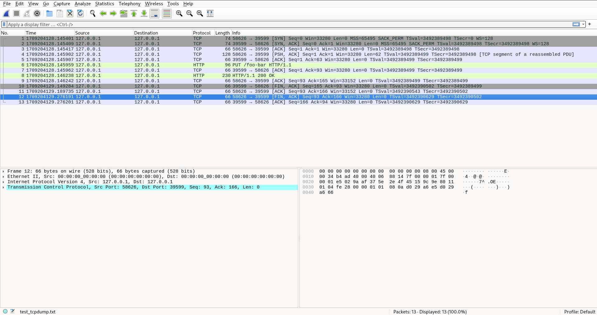

## Eventlet debug resources

### Use tox as virtual env

You can run Eventlet's all its unit tests by using tox:

```shell
$ tox
```

The previous command will run unit tests with all the Eventlet hubs.

You can select a specific Eventlet hub (described in sections below) by using:

```shell
$ tox -e py312-asyncio
```

The previous command create `.tox/py312-asyncio/bin` directory that you
can access manually to trigger things in a more fine grained way.

### Run a Specific Unit Test Case

The following commands requires setup a tox environment first. See the
previous section.

Run all the tests of the wsgi test module:

```shell
$ .tox/py312-asyncio/bin/py.test tests/wsgi_test.py
```

Run a specific [unit test case](https://docs.python.org/3/library/unittest.html#unittest.TestCase) of the wsgi test module:

```shell
$ .tox/py312-asyncio/bin/py.test tests/wsgi_test.py::TestHttpd
```

Run an individual test belonging to a specific [unit test case](https://docs.python.org/3/library/unittest.html#unittest.TestCase) of the wsgi test module:

```shell
$ .tox/py312-asyncio/bin/py.test \
tests/wsgi_test.py::TestHttpd::test_close_idle_connections_listen_socket_closed
```

### Trigger PDB when a test is failing

```shell
$ .tox/py312-asyncio/bin/py.test --pdb tests/asyncio_test.py
```

### Switch between hubs

Eventlet provide [various hubs](https://eventlet.readthedocs.io/en/latest/hubs.html). Hubs are designed to dispatches I/O events and schedules greenthreads.

Eventlet provide multiple hub implementations. The goal here is to see how to switch to one hub to another during your debug session.

Using Eventlet's [asyncio hub](https://eventlet.readthedocs.io/en/latest/migration.html#step-1-switch-to-the-asyncio-hub):

```shell
$ export EVENTLET_HUB=asyncio; \
.tox/py312-asyncio/bin/py.test tests/wsgi_test.py::TestHttpd
```

Using Eventlet's epoll hub:

```shell
$ export EVENTLET_HUB=epoll; \
.tox/py312-asyncio/bin/py.test tests/wsgi_test.py::TestHttpd
```

### Strace Unit Tests

[strace](https://strace.io/) is a diagnostic, debugging and
instructional userspace utility for Linux. It is used to monitor
and tamper with interactions between processes and the Linux kernel,
which include system calls, signal deliveries, and changes of process
state.

During your debug session you may want to `strace` your unit tests or a specific eventlet runtime. This section show you some examples of `strace` usages in an Eventlet context.

Strace a specific unit test from the [wsgi test module](https://github.com/eventlet/eventlet/blob/master/tests/wsgi_test.py):

```shell
$ export EVENTLET_HUB=asyncio
$ .tox/py312-asyncio/bin/py.test \
tests/wsgi_test.py::TestHttpd::test_close_idle_connections_listen_socket_closed  & \
strace -p $!
```

The `$!` parameter allow you to retrieve the process ID (pid) of the most recently executed process. As we put the execution of your unit test in background, the strace command should normally retrieve the pid of your unit test.

Running the previous command generated something like the following output:

```strace
accept4(15, 0x7ffe3e4855b0, [16], SOCK_CLOEXEC) = -1 EAGAIN (Resource temporarily unavailable)
fstat(15, {st_mode=S_IFSOCK|0777, st_size=0, ...}) = 0
epoll_ctl(11, EPOLL_CTL_ADD, 15, {EPOLLIN, {u32=15, u64=15}}) = 0
epoll_ctl(11, EPOLL_CTL_DEL, 14, 0x7ffe3e4869bc) = 0
getsockopt(14, SOL_SOCKET, SO_ERROR, [0], [4]) = 0
connect(14, {sa_family=AF_INET, sin_port=htons(45997), sin_addr=inet_addr("127.0.0.1")}, 16) = 0
epoll_wait(11, [], 2, 0)                = 0
mmap(NULL, 16384, PROT_READ|PROT_WRITE, MAP_PRIVATE|MAP_ANONYMOUS, -1, 0) = 0x7f3652da7000
setsockopt(16, SOL_TCP, TCP_QUICKACK, [1], 4) = 0
recvfrom(16, 0x557361928320, 8192, 0, NULL, NULL) = -1 EAGAIN (Resource temporarily unavailable)
fstat(16, {st_mode=S_IFSOCK|0777, st_size=0, ...}) = 0
epoll_ctl(11, EPOLL_CTL_ADD, 16, {EPOLLIN, {u32=16, u64=16}}) = 0
sendto(14, "PUT /foo-bar HTTP/1.1\r\nHost: loc"..., 62, 0, NULL, 0) = 62
epoll_wait(11, [{EPOLLIN, {u32=16, u64=16}}], 3, 0) = 1
sendto(14, "ABCABCABCABCABCABCABCABCABCABC", 30, 0, NULL, 0) = 30
epoll_ctl(11, EPOLL_CTL_DEL, 16, 0x7ffe3e48504c) = 0
recvfrom(16, "PUT /foo-bar HTTP/1.1\r\nHost: loc"..., 8192, 0, NULL, NULL) = 92
getsockname(16, {sa_family=AF_INET, sin_port=htons(45997), sin_addr=inet_addr("127.0.0.1")}, [16]) = 0
sendto(16, "HTTP/1.1 200 OK\r\nContent-Type: a"..., 164, 0, NULL, 0) = 164
recvfrom(16, 0x557361928320, 8192, 0, NULL, NULL) = -1 EAGAIN (Resource temporarily unavailable)
fstat(16, {st_mode=S_IFSOCK|0777, st_size=0, ...}) = 0
epoll_ctl(11, EPOLL_CTL_ADD, 16, {EPOLLIN, {u32=16, u64=16}}) = 0
epoll_wait(11, [], 3, 0)                = 0
recvfrom(14, "HTTP/1.1 200 OK\r\nContent-Type: a"..., 8192, 0, NULL, NULL) = 164
epoll_wait(11, [], 3, 0)                = 0
shutdown(15, SHUT_RDWR)                 = 0
epoll_wait(11, [{EPOLLHUP, {u32=15, u64=15}}], 3, 0) = 1
close(15)                               = 0
epoll_ctl(11, EPOLL_CTL_DEL, 15, 0x7ffe3e48564c) = -1 EBADF (Bad file descriptor)
accept4(-1, 0x7ffe3e4855b0, [16], SOCK_CLOEXEC) = -1 EBADF (Bad file descriptor)
accept4(-1, 0x7ffe3e4855b0, [16], SOCK_CLOEXEC) = -1 EBADF (Bad file descriptor)
...
accept4(-1, 0x7ffe3e4855b0, [16], SOCK_CLOEXEC) = -1 EBADF (Bad file descriptor)
```

We can observe that something went wrong during the execution of this test
when using the Eventlet asyncio hub.

To avoid unexpected pid creation I'd suggest to use a container to run your unit tests and to isolate your process in an environment with a low system activity level. You can use my [machine project](https://github.com/4383/machine) to setup this isolated environment. Here below is a demo of this kind of environment.

[](https://asciinema.org/a/0e7cLRsHiNJlBQdlIgdkApAsU)

### Profile Unit Tests

Profiling a specific unit test (`test_001_server`) from the wsgi test module:

```shell
$ export EVENTLET_HUB=asyncio; \
.tox/py312-asyncio/bin/python -m cProfile -o profiling.cprof \
.tox/py312-asyncio/bin/py.test \
tests/wsgi_test.py::TestHttpd::test_001_server
```

You can even profile and `strace` this test at the same time:

```shell
$ export EVENTLET_HUB=asyncio; \
.tox/py312-asyncio/bin/python -m cProfile -o profiling.cprof \
.tox/py312-asyncio/bin/py.test \
tests/wsgi_test.py::TestHttpd::test_001_server & \
strace -p $!
```

Once done, you can use [pyprof2calltree](https://pypi.org/project/pyprof2calltree/)
command to convert your profiling data into a format that can be opened with
[KCacheGrind](https://kcachegrind.github.io/html/Home.html). Example:

```shell
$ export EVENTLET_HUB=asyncio; \
.tox/py312-asyncio/bin/python -m cProfile -o profiling.cprof \
.tox/py312-asyncio/bin/py.test \
tests/wsgi_test.py::TestHttpd::test_001_server & \
strace -p $!
$ pyprof2calltree -k -i profiling.cprof
```

The previous last command opened KCacheGrind with our data:


### Check a new underlying library version upgrade

Eventlet wrap a couple of underlying libraries, like [dnspython](https://pypi.org/project/dnspython).
Sometime a new version of these libraries come with a new API that need
to be reflected on the Eventlet side. Here is a [concrete example](https://github.com/eventlet/eventlet/pull/916).
In this example dnspython just came with a new release candidate that won't
be pulled by pip, the following example show you how to check that there is
no regressions between the current stable version and the coming release
candidate version:

```shell
$ # force recreating a new tox env from scratch:
$ tox -r -e py312 # ok with version 2.5.0 (the default pulled version)
$ # upgrade to the release candidate version:
$ .tox/py312/bin/pip install --force-reinstall -v dnspython==2.6.0rc1
$ # reusing this updated tox env:
$ tox -e py312 # ok with the newer version 2.6.0rc1
```

### Network analyze

You may want to analyze networks packets generated by using Eventlet.
The following command will generate a `pcap` file containing captured packets
on the `lo` (localhost) network interface.
Every entries of this file will be prefixed with a unix timestamp, allowing
you to compare with traced syscall made with `strace`:

```
sudo tcpdump -w tcpdump.pcap -i lo -tttt
```

This pcap file can be opened and viewed by using wireshark. Wireshark's
rendering will be more user friendly.



### Get All Asyncio Tasks Within PDB

Consider the following test as a failing test who will trigger a PDB post
mortem analysis:

```
$ .tox/py312-asyncio/bin/py.test --pdb tests/asyncio_test.py
...
eventlet/asyncio.py:56: in _run
return future.result()
_ _ _ _ _ _ _ _ _ _ _ _ _ _ _ _ _ _ _ _ _ _ _

>   async def go():
E   asyncio.exceptions.CancelledError

tests/asyncio_test.py:235: CancelledError
>>>>>>>>>>>>>>>>> entering PDB >>>>>>>>>>>>>>>>>>>

>>>>>>>>>>>>>>>>> PDB post_mortem (IO-capturing turned off) >>>>>>>>>>>>>>>
> /home/dev/app/tests/asyncio_test.py(235)go()
-> async def go():
(Pdb) import asyncio
(Pdb) tasks = asyncio.all_tasks()
(Pdb) pp tasks
{<Task pending name='Task-1' coro=<Hub.run.<locals>.async_run() running at /home/dev/app/eventlet/hubs/asyncio.py:141> cb=[_run_until_complete_cb() at /usr/local/lib/python3.12/asyncio/base_events.py:181] created at /usr/local/lib/python3.12/asyncio/tasks.py:695>}
```

In the previous example we imported `asyncio` and then we retrieved
all the tasks of the current event loop.

### Retrieve All the Active Threads From PDB

```
$ .tox/py312-asyncio/bin/py.test --pdb tests/asyncio_test.py
...
eventlet/asyncio.py:56: in _run
return future.result()
_ _ _ _ _ _ _ _ _ _ _ _ _ _ _ _ _ _ _ _ _ _ _

>   async def go():
E   asyncio.exceptions.CancelledError

tests/asyncio_test.py:235: CancelledError
>>>>>>>>>>>>>>>>> entering PDB >>>>>>>>>>>>>>>>>>>

>>>>>>>>>>>>>>>>> PDB post_mortem (IO-capturing turned off) >>>>>>>>>>>>>>>
> /home/dev/app/tests/asyncio_test.py(235)go()
-> async def go():
(Pdb) import threading
(Pdb) threading._active
{140007515125568: <_MainThread(MainThread, started 140007515125568)>}
```

In the example above only one thread is currently running. If other threads
exists in the current process they will be also listed here.

### Debug Eventlet With eBPF and BCC

Eventlet is based on [greenlet](https://greenlet.readthedocs.io/en/latest/history.html),
so to see what happens under the hood of Eventlet, especially with greenthreads,
we have to observe what greenlet is doing.

The Greenlet documentation says:

> The “greenlet” package is a spin-off of Stackless, a version of CPython that
  supports micro-threads called “tasklets”. Tasklets run pseudo-concurrently
  (typically in a single or a few OS-level threads) and are synchronized with
  data exchanges on “channels”.

> Greenlets are provided as a C extension module for the regular unmodified
  Python interpreter.

In this case various elf tools can help us to observe specific parts of
Greenlet. These will help us to implement our own bcc user-space probs.

First what are the shared libraries used by Greenlet:
```shell
$ ldd .tox/py312-asyncio/lib/python3.12/site-packages/greenlet/_greenlet.cpython-312-x86_64-linux-gnu.so
        linux-vdso.so.1 (0x00007ffc2936a000)
        libstdc++.so.6 => /lib64/libstdc++.so.6 (0x00007f599ae00000)
        libm.so.6 => /lib64/libm.so.6 (0x00007f599b10c000)
        libgcc_s.so.1 => /lib64/libgcc_s.so.1 (0x00007f599b0e8000)
        libpthread.so.0 => /lib64/libpthread.so.0 (0x00007f599b0e3000)
        libc.so.6 => /lib64/libc.so.6 (0x00007f599ac1e000)
        /lib64/ld-linux-x86-64.so.2 (0x00007f599b224000)
```

```
$ dumpelf .tox/py312-asyncio/lib/python3.12/site-packages/greenlet/_greenlet.cpython-312-x86_64-linux-gnu.so
#include <elf.h>

/*
 * ELF dump of '.tox/py312-asyncio/lib/python3.12/site-packages/greenlet/_greenlet.cpython-312-x86_64-linux-gnu.so'
 *     1514208 (0x171AE0) bytes
 */

Elf64_Dyn dumpedelf_dyn_0[];
struct {
        Elf64_Ehdr ehdr;
        Elf64_Phdr phdrs[10];
        Elf64_Shdr shdrs[38];
        Elf64_Dyn *dyns;
} dumpedelf_0 = {

.ehdr = {
        .e_ident = { /* (EI_NIDENT bytes) */
                /* [0] EI_MAG:        */ 0x7F,'E','L','F',
                /* [4] EI_CLASS:      */ 2 , /* (ELFCLASS64) */
                /* [5] EI_DATA:       */ 1 , /* (ELFDATA2LSB) */
                /* [6] EI_VERSION:    */ 1 , /* (EV_CURRENT) */
                /* [7] EI_OSABI:      */ 0 , /* (ELFOSABI_NONE) */
                /* [8] EI_ABIVERSION: */ 0 ,
                /* [9-15] EI_PAD:     */ 0x0, 0x0, 0x0, 0x0, 0x0, 0x0, 0x0,
        },
        .e_type      = 3          , /* (ET_DYN) */
        .e_machine   = 62         , /* (EM_X86_64) */
        .e_version   = 1          , /* (EV_CURRENT) */
        .e_entry     = 0x0        , /* (start address at runtime) */
        .e_phoff     = 64         , /* (bytes into file) */
        .e_shoff     = 1511776    , /* (bytes into file) */
        .e_flags     = 0x0        ,
        .e_ehsize    = 64         , /* (bytes) */
        .e_phentsize = 56         , /* (bytes) */
        .e_phnum     = 10         , /* (program headers) */
        .e_shentsize = 64         , /* (bytes) */
        .e_shnum     = 38         , /* (section headers) */
        .e_shstrndx  = 37        
},

.phdrs = {
/* Program Header #0 0x40 */
{
        .p_type   = 1          , /* [PT_LOAD] */
        .p_offset = 0          , /* (bytes into file) */
        .p_vaddr  = 0x0        , /* (virtual addr at runtime) */
        .p_paddr  = 0x0        , /* (physical addr at runtime) */
        .p_filesz = 35112      , /* (bytes in file) */
        .p_memsz  = 35112      , /* (bytes in mem at runtime) */
        .p_flags  = 0x4        , /* PF_R */
        .p_align  = 4096       , /* (min mem alignment in bytes) */
},
/* Program Header #1 0x78 */
...
```

```shell
$ nm .tox/py312-asyncio/lib/python3.12/site-packages/greenlet/_greenlet.cpython-312-x86_64-linux-gnu.so
...
                 U PyGC_Disable
                 U PyGC_Enable
                 U PyGC_IsEnabled
0000000000012720 t PyGreenlet_GetCurrent
000000000000b6f7 t PyGreenlet_GetCurrent.cold
0000000000013590 t PyGreenlet_New
000000000000bc1d t PyGreenlet_New.cold
000000000000d980 t PyGreenlet_SetParent
000000000000a056 t PyGreenlet_SetParent.cold
000000000000f520 t PyGreenlet_Switch
0000000000010560 t PyGreenlet_Throw
000000000000ac6c t PyGreenlet_Throw.cold
0000000000021c60 D PyGreenlet_Type
0000000000021ac0 D PyGreenletUnswitchable_Type
                 U PyImport_ImportModule
000000000000fcb0 T PyInit__greenlet
000000000000a447 t PyInit__greenlet.cold
...
```

### Links

- [Eventlet Documentation](https://eventlet.readthedocs.io/)
- [How to Debug Python](python.html)
